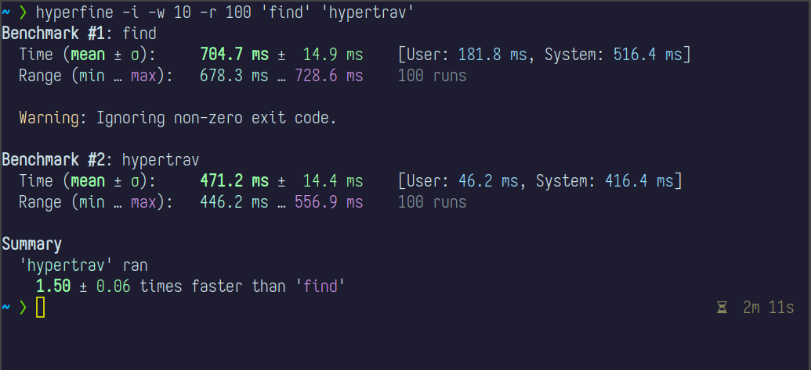

# hypertrav

## what
`hypertrav` recursively lists files and directories as fast as possible. Think `find .` without any bells and whistles.

It's 1.5 times faster than GNU `find`.

(benchmarked with [the amazing `hyperfine`](https://github.com/sharkdp/hyperfine))

## why
Intended for use with `fzf` or as a front end to any interactive narrowing feature.

Simply `hypertrav | fzf` or `export FZF_CTRL_T_COMMAND=hypertrav`.

## how
Build with `make build` and move the created `bin/hypertrav` somewhere on your $`PATH`.
Including parallel reading for SSDs soon. With :heart: and :green_salad: by Exr0n.

